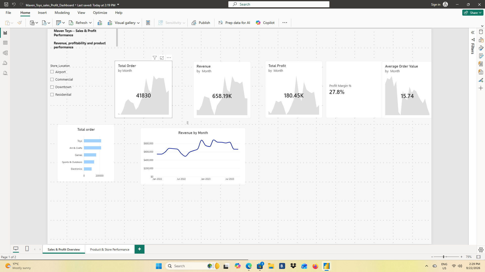
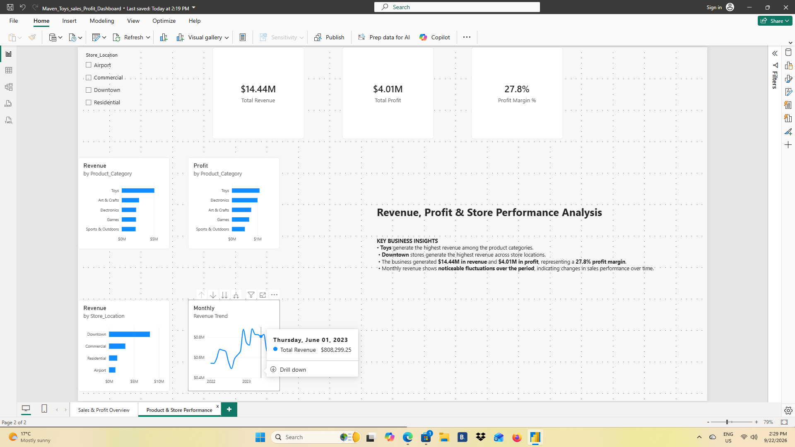

# Maven Toys — Power BI Sales & Profit Dashboard

## Project Overview

An interactive Power BI dashboard analyzing sales performance for Maven Toys, a fictional toy-store chain.

The project focuses on revenue, profitability, product category performance, store location performance, and monthly sales trends.

## Business Questions

- How much revenue and profit is the business generating?
- Which product categories generate the most revenue and profit?
- Which store locations generate the most revenue?
- How does revenue change over time?
- What is the overall profit margin?
- What is the average order value?

## Dashboard Pages

### 1. Sales & Profit Overview

Provides a high-level view of:

- Total Orders
- Total Revenue
- Total Profit
- Profit Margin
- Average Order Value
- Orders by Product Category
- Monthly Revenue Trend

### 2. Product & Store Performance

Provides deeper analysis of:

- Revenue by Product Category
- Profit by Product Category
- Revenue by Store Location
- Monthly Revenue Trend
- Store Location filtering
- Key Business Insights

## Key Results

- Total Revenue: **$14.44M**
- Total Profit: **$4.01M**
- Profit Margin: **27.8%**
- Highest Revenue Product Category: **Toys**
- Highest Revenue Store Location: **Downtown**

## Data Source

Maven Analytics — Maven Toys Guided Project.

The dataset contains sales, products, stores, inventory, calendar, and data dictionary information.

## Dashboard Preview

### Sales & Profit Overview

### Product & Store Performance

## Key Takeaways

- Toys generated the highest revenue among product categories.
- Downtown stores generated the highest revenue among store locations.
- Total revenue was $14.44M with $4.01M in total profit.
- Overall profit margin was 27.8%.

## Skills Demonstrated

- Power BI
- DAX
- Data modeling
- KPI development
- Interactive dashboard design
- Revenue and profitability analysis
- Product and store performance analysis

## Author

Adebayo Ayotomiwa Praise
